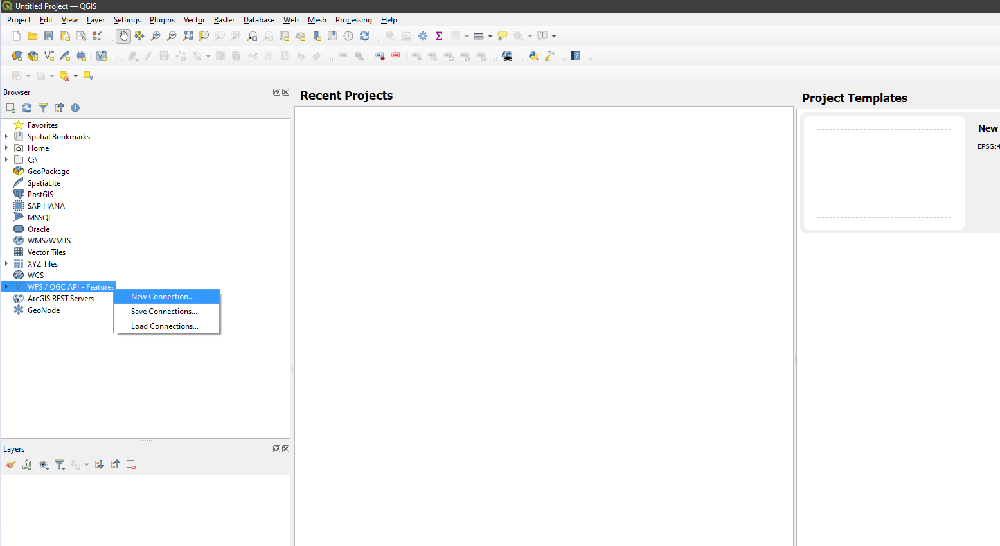
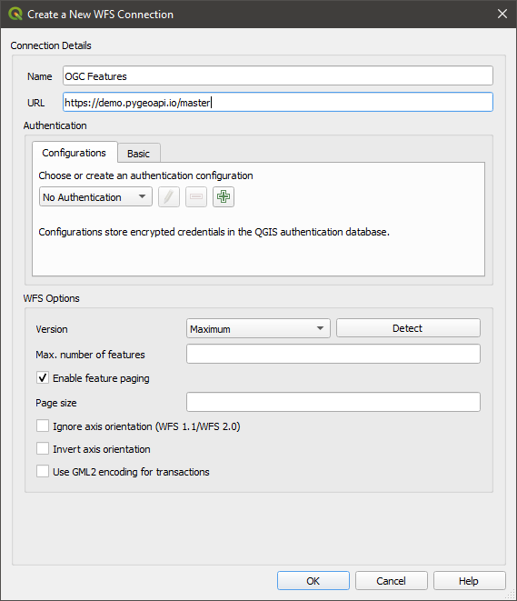
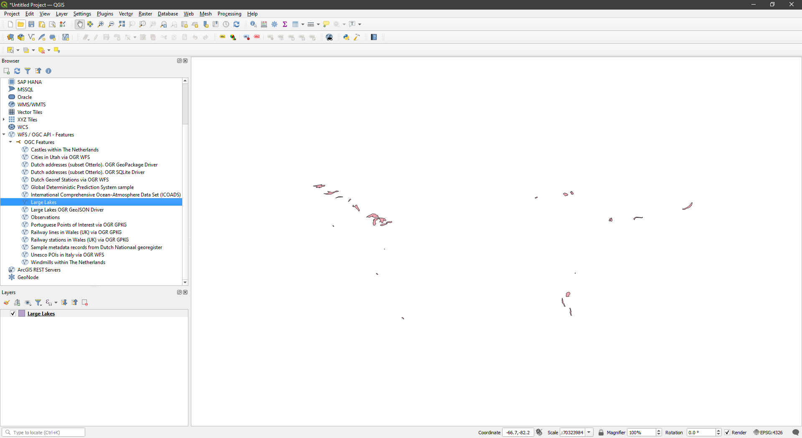

# Steps

### 1 - Installation

Download the latest version of QGIS from their [download page](https://qgis.org/en/site/forusers/download.html). Select
the standalone installer if you only want QGIS.

### 2 - Adding data source

Right-click to add a new data source in QGIS. Select the new connection options.

The dialog opened can now be used to fill in the API base url to fetch the collections that can later be added to the
map. You can select other options if required.

### 3 - Adding features to map

Now that the connection is added, you can expand the newly added data source and double-click on the collection you wish
to add to the map for viewing.
